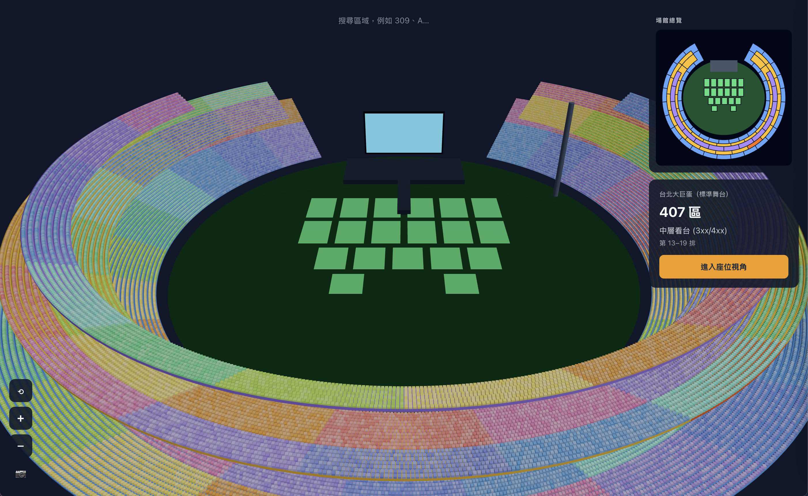

# 3D Taipei Dome

[繁體中文](./README.zh-TW.md)



An interactive 3D venue map inspired by Taipei Dome. It helps users understand where their seating area is located and explore the venue more intuitively before arriving.

## Features

- Explore the venue in an interactive 3D view
- Search for and select seating sections
- Use the minimap to understand each section's location
- Switch to a point-of-view mode from the selected section
- Capture and download a screenshot of the current view

## Getting Started

Install the dependencies:

```bash
npm install
```

Start the development server:

```bash
npm run dev
```

Then open [http://localhost:3000](http://localhost:3000) in your browser.

## Tech Stack

- [Next.js](https://nextjs.org/)
- [React](https://react.dev/)
- [Three.js](https://threejs.org/)
- [React Three Fiber](https://r3f.docs.pmnd.rs/)

## Disclaimer

This project is an unofficial venue visualization created for orientation and demonstration purposes. It is not affiliated with Taipei Dome, and the displayed layout may differ from the actual venue.
